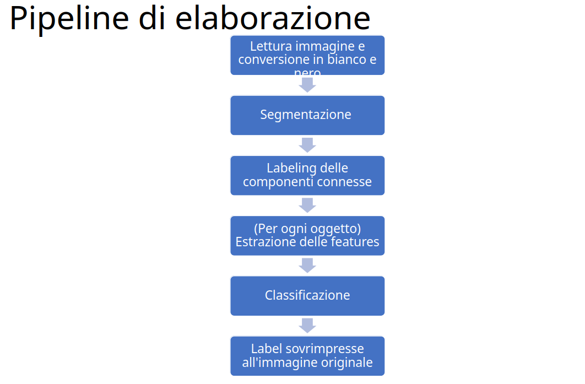

# Classificazione di utensili
Progetto Elab. Imm. A.A. 2022-2023
Obiettivo: classificare strumenti da lavoro.  

Il training set comprende 10 classi di oggetti:
forbice, metro, pinza, chiave, martello, cacciavite, avvitatore,
pappagallo, lima, pennarello.
5 tipi di sfondi: legno, cartone, gomma nera, piastrelle, uniforme.

